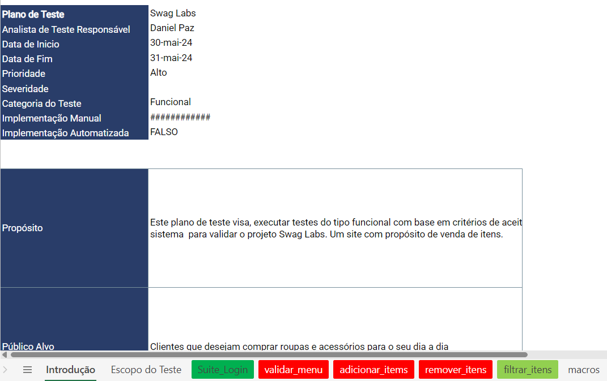
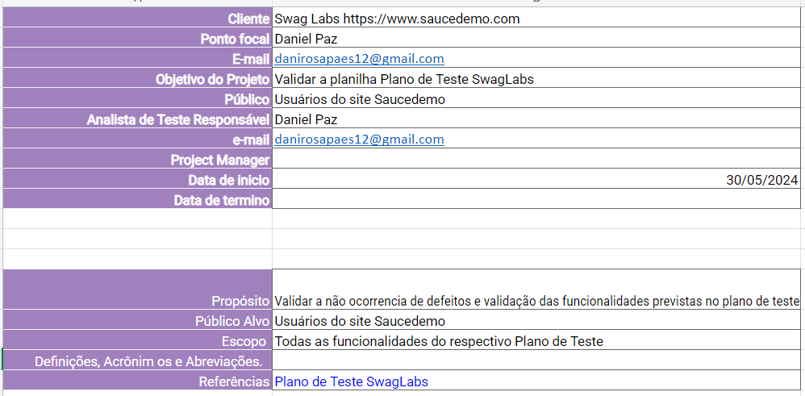
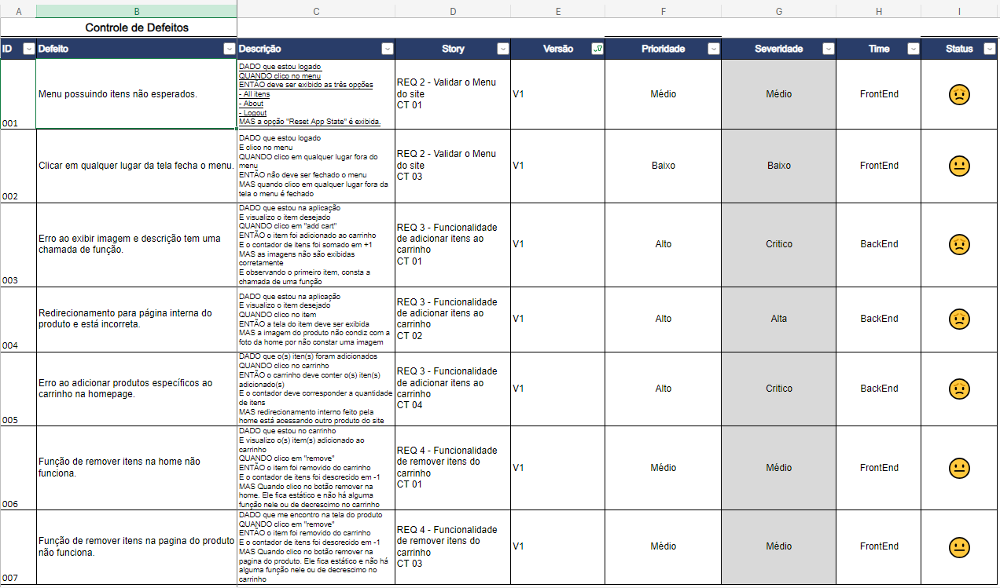
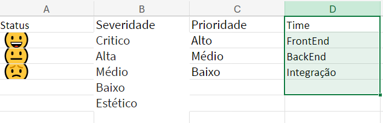

# Planilha Controle de Bugs

A função deste portfólio é demonstrar as competências em como eu faço a abertura e gestão de bugs. Os defeitos foram registrados conforme a planilha de Plano de Teste.

# Ferramentas

Levantamento de defeitos conforme [Plano de Teste](https://onedrive.live.com/edit.aspx?resid=ea833b46605cd9b9!s7efb321a-4950-4c14-89d6-434c4048db2e&cid=ea833b46605cd9b9&login_hint=danirosapaes12%40gmail.com&ct=1717157240731&wdOrigin=OFFICECOM-WEB.START.UPLOAD&wdPreviousSessionSrc=HarmonyWeb&wdPreviousSession=216d99ea-6884-4873-87f7-5983970e7a17)

-Excell utilizado para gerenciamento das planilhas.

## Controle de Bugs

### Apresentação do Plano

Na aba Introdução da planilha irá conter todas as informações básicas do projeto.

## Apresentação aba Controle de Bugs

Na aba Controle de Bugs, contém todos os defeitos registrados, assim como sua descrição, story, versão do software testado, prioridade, severidade, time responsável e indicador de status. Sendo eles:

- Defeito: Um título breve e claro do defeito aberto.

- Descrição: A descrição utiliza Gherkin para detalhar o passo a passo de como o defeito foi encontrado.

- Story: A história da respectiva funcionalidade, juntamente com o ID do caso de teste.

- Prioridade: A prioridade determina a ordem de correção de um defeito, ou seja, quão urgente é resolver o problema.

- Severidade: Indica o impacto de um defeito no funcionamento do sistema. É uma medida que avalia a gravidade do problema e como ele afeta o desempenho ou usabilidade do software.

- Time responsavel: O provável time responsável por aquela funcionalidade não estar funcionando corretamente.

- Indicador de Status: É uma representação visual do resultado do teste.

## Apresentação dos Macros

Na aba Macros esta todas as regras e configuracoes da planilha ex:

- Tipos de teste
- Severidade
- Prioridade
- Meios de teste
- Status com emojis

Esta planilha foi disponiblizado pela Priscila de Araujo Caimim, professora da plataforma Qualiters Club. Plataforma de onde estudo.