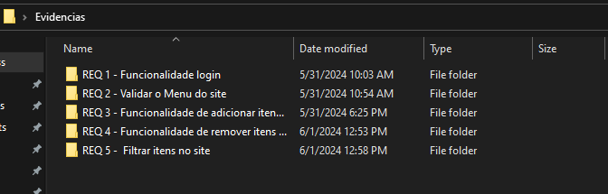
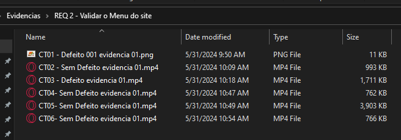

## Apresentação da pasta de evidências

Esta pasta de evidencias conta com prints (fotos) e videos dos casos de teste e o respectivo ID de seu caso de teste.

Todos separados por suas histórias de requisitos, e seu respectivo número, assim como a função.

- CT = Caso de Teste

- REQ = Requerimento