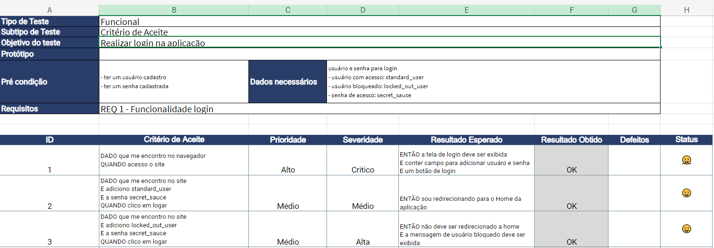

# Planilha Plano de Teste
A função deste portfólio é demonstrar as competências de como faço a abertura e gestão de bugs. Este plano de teste foi criado pela Priscila de Araujo Caimi. Fundadora e professora da plataforma Qualiters Club. Fiz apenas alguns ajustes aqui e ali para ficar do meu jeitinho. 

Site utilizado para desenvolvimento do Plano [SwagLabs](https://www.saucedemo.com/v1/)

- Excell para a criação do Plano de teste

## Plano de Teste

### Apresentação do Plano

Na aba Introdução da planilha irá conter todas as informações básicas do projeto.

## Apresentação do Escopo

Na aba Escopo da planilha irá conter todos os levantamentos de requisitos, critério de aceite, os tipos de testes que serão realizados, assim como a prioridade e severidade deles. Além da meta e progresso de cada um.

## Apresentação da Suite - Tela de Login

Antes de tudo, em todas as Suites têm as mesmas funcionalidades, então para não ficar redundante e repetitivo, vou listar as funções delas abaixo e detalhar em cada uma o propósito da mesma.

- ID: Cada id representa um caso de teste, que iremos tratar nesse portfolio como CT e respectivamente o número deste caso de teste.

- Critérios de Aceite: São as condições escritas em Gherking que o teste deve cumprir para passar,

- Prioridade: A prioridade determina a ordem de correção de um defeito, ou seja, quão urgente é resolver o problema.

- Severidade: Indica o impacto de um defeito no funcionamento do sistema. É uma medida que avalia a gravidade do problema e como ele afeta o desempenho ou usabilidade do software.

- Resultado Esperado: É o que deveria acontecer quando o teste é executado corretamente.

- Resultado Obtido: Onde o "OK" são para testes que passaram e "NOK" para testes que foi registrado algum bug.

- Registro de Defeito: É uma forma de documentar defeitos e bugs com evidências. Cada bug tera um ID comecando pelo 001, e sera documentado na planilha de Controle de Bugs. 

- Indicador de Status: É uma representação visual do resultado do teste.

Na aba suite_login tem como objetivo validar a funcionalidade login, como o critério de aceite. Contém o caso de teste funcional que valida a função anterior.

Nesta Suite de tres (3) testes, todos passaram sem problemas algum.

## Apresentação da Suite - Validar Menu

Na aba Suite validar_menu tem como objetivo validar a funcionalidade do menu do site, como o critério de aceite. Contém o caso de teste funcional que valida a função anterior.

Nesta Suite tivemos de seis (6) testes, dois (2) Defeitos foram abertos sendo eles (CT 01 - 001) e (CT 03 - 002). Sendo colocado o ID na planilha Controle de Bugs registrando o que ocorreu e estão na pasta de evidências.

## Apresentação da Suite - Adicionar Itens

Na aba Suite adicionar_itens tem como objetivo validar a funcionalidade de adicionar itens ao carrinho, como o critério de aceite. Contém o caso de teste funcional que valida a função anterior.

Nesta Suite tivemos de quatro (4) testes, dois (2) Defeitos foram abertos sendo eles (CT 01 - 003) e (CT 02 - 004). Sendo colocado o ID na planilha de controle de bugs registrando o que ocorreu e estão na pasta de evidências.

## Apresentação da Suite - Remover Itens

Na aba Suite remover_itens tem como objetivo validar a funcionalidade de remover itens do carrinho, como o critério de aceite. Contém o caso de teste funcional que valida a função anterior.

Nesta Suite tivemos de quatro (4) testes, dois (2) Defeitos foram abertos sendo eles (CT 01 - 006) e (CT 03 - 007). Sendo colocado o ID na planilha de controle de bugs registrando o que ocorreu e estão na pasta de evidências.

## Apresentação da Suite - Filtrar Itens

Na aba Suite filtrar_itens tem como objetivo validar a funcionalidade de filtrar itens no site, como o critério de aceite. Contém o caso de teste funcional que valida a função anterior.

Nesta Suite de um (1) testes, todos passaram sem problemas algum.

## Apresentação dos Macros

Na aba Macros esta todas as regras e configuracoes da planilha ex:

- Tipos de teste
- Severidade
- Prioridade
- Meios de teste
- Status com emojis

Lembrando que esta planilha foi disponiblizado pela Priscila de Araujo Caimim, professora da plataforma Qualiters Club. Plataforma de onde estudo.
