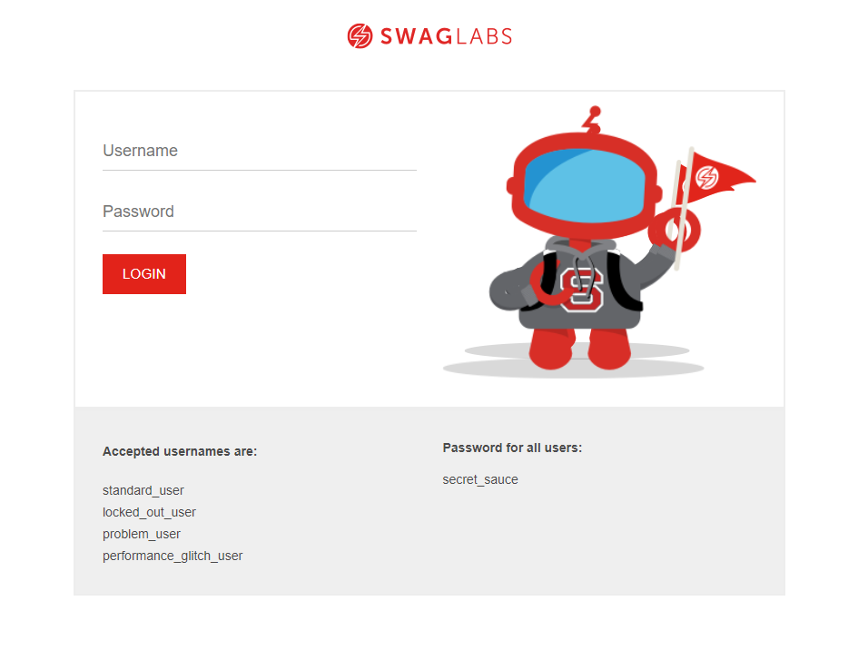
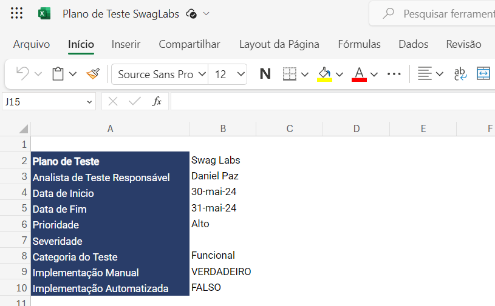
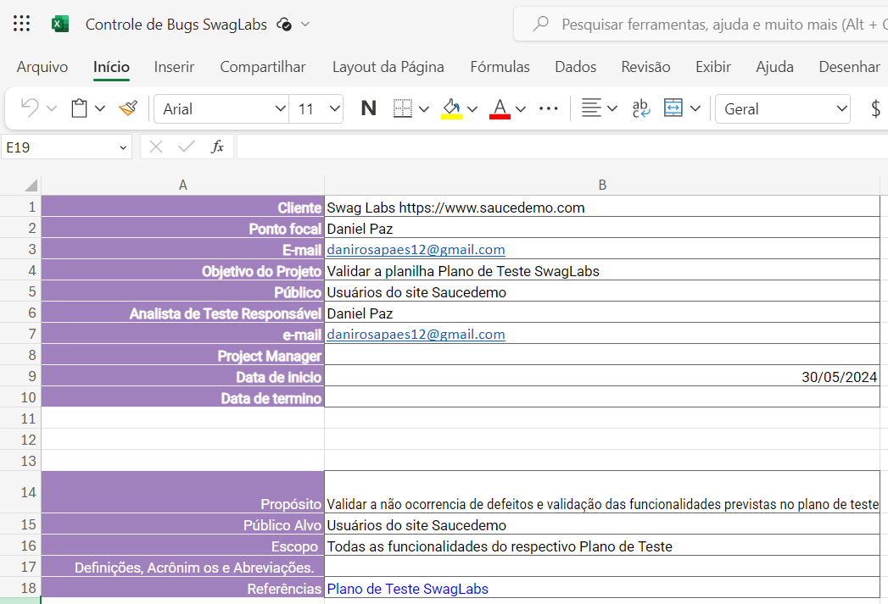

# Portfólio

Este projeto tem como função mostrar minhas capacidades técnicas de testar, executar, abrir e gerenciar bugs eventuais do sistema. Assim como fazer o gerenciamento dos mesmos itens. Para isso irei utulizar o site **SwagLabs**

## SwagLabs

SwagLabs é um site frequentemente utilizado por QA's para testar, demonstrar, utulizar ferramentas e técnicas de testes de software. SwagLabs Oferecen um cenário realista de um site de E-commerce com funcionalidades variadas para serem testadas. Todo Plano de teste foi desenvolvido em cima deste site.

## Neste portfólio, você irá encontrar duas (2) planilhas, sendo:

- Plano de Teste SwagLabs
- Controle de Bugs SwagLabs

## Portfólio Plano de Teste

- Planilha de Teste [SwagLabs](https://onedrive.live.com/edit.aspx?resid=ea833b46605cd9b9!s7efb321a-4950-4c14-89d6-434c4048db2e&cid=ea833b46605cd9b9&login_hint=danirosapaes12%40gmail.com&ct=1717157240731&wdOrigin=OFFICECOM-WEB.START.UPLOAD&wdPreviousSessionSrc=HarmonyWeb&wdPreviousSession=216d99ea-6884-4873-87f7-5983970e7a17)

## Portfólio Controle de Bugs

- Planilha de [Controle de Bugs](https://onedrive.live.com/edit.aspx?resid=ea833b46605cd9b9!s8c20db69-eada-4518-9783-08b4140d016d&cid=ea833b46605cd9b9&login_hint=danirosapaes12%40gmail.com&ct=1717157271032&wdOrigin=OFFICECOM-WEB.START.UPLOAD&wdPreviousSessionSrc=HarmonyWeb&wdPreviousSession=216d99ea-6884-4873-87f7-5983970e7a17)

